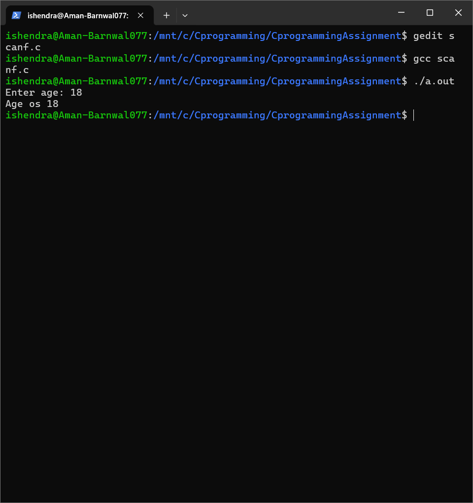
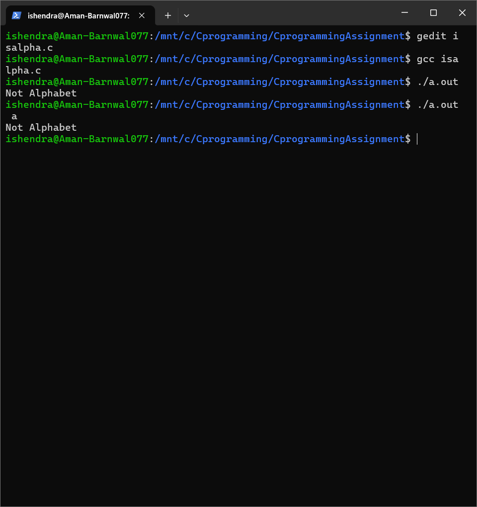
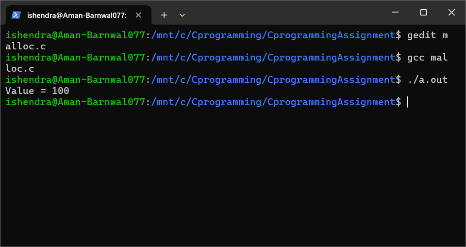
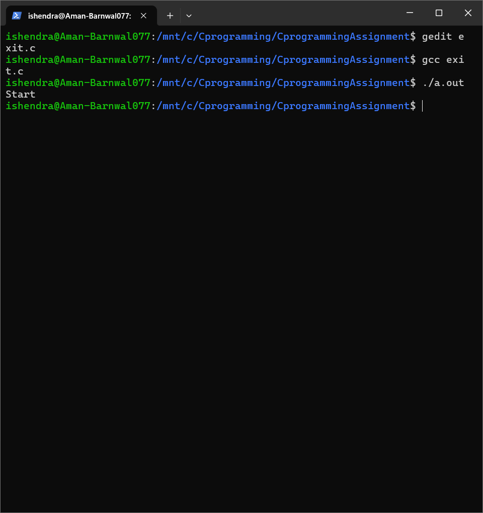
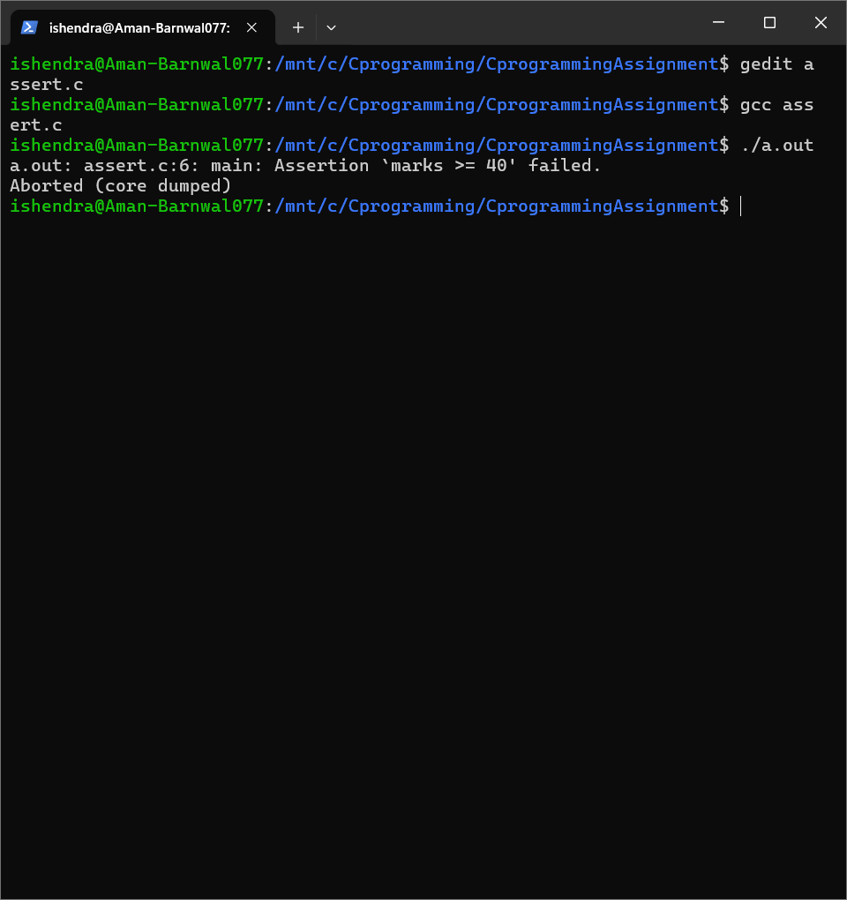
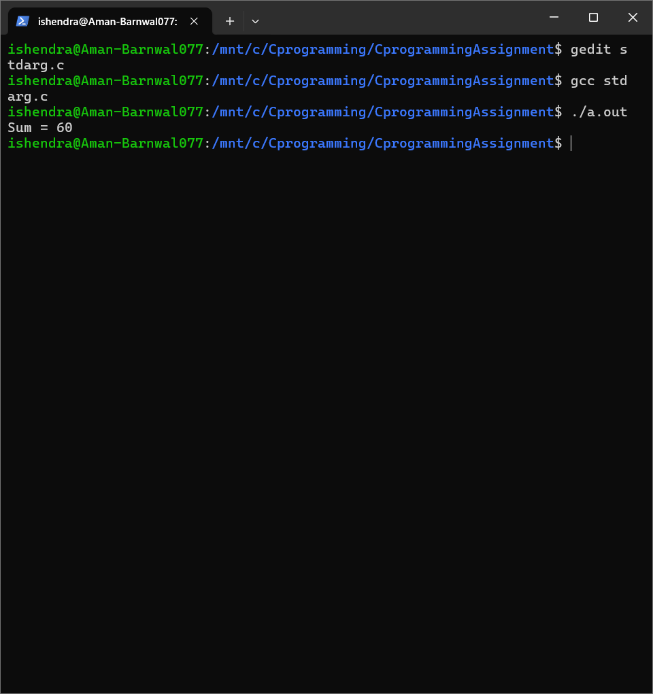
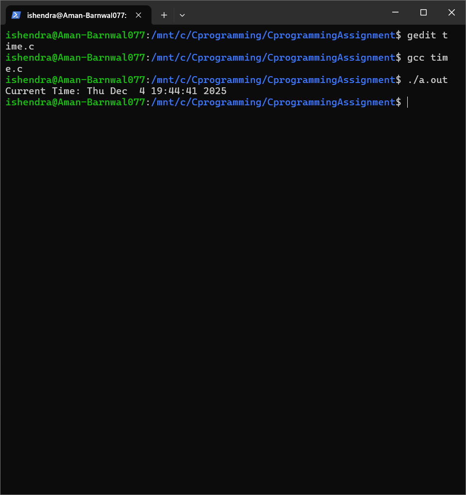
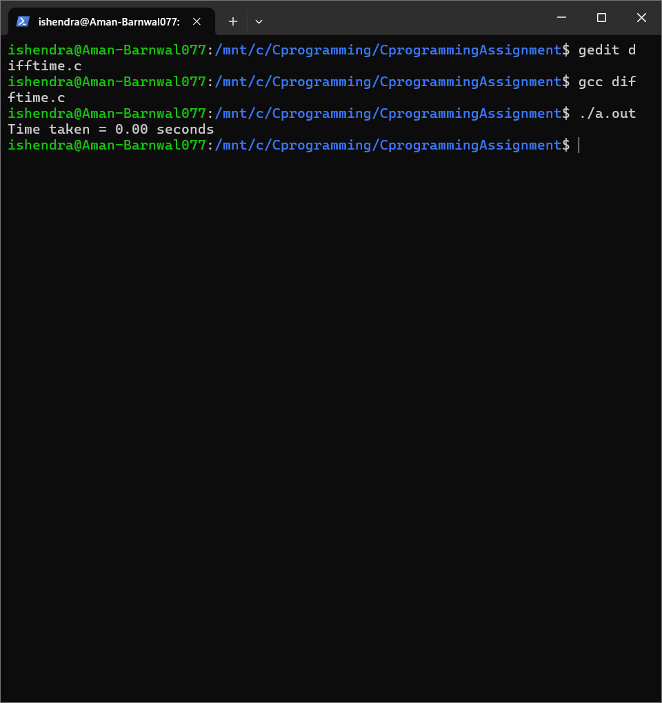

# C Library Functions Demonstration – Clibrary

This repository contains practical demonstrations of major C standard library functions with
source code and execution outputs.

---

## Repository Link

https://github.com/aman-barnwal/Clibrary

---

## Header Files Covered

- stdio.h  
- ctype.h  
- stdlib.h  
- assert.h  
- stdarg.h  
- time.h  

---

## Program Index (Code and Output)

All programs include source code and output screenshots where applicable.

---

### printf() — stdio.h

Source Code: [printf.c](./printf.c)  
Output:


---

### scanf() — stdio.h

Source Code: [scanf.c](./scanf.c)  
Output:


---

### isalpha() — ctype.h

Source Code: [isalpha.c](./isalpha.c)  
Output:


---

### isdigit() — ctype.h

Source Code: [isdigit.c](./isdigit.c)  
Output not provided.

---

### malloc() — stdlib.h

Source Code: [malloc.c](./malloc.c)  
Output:


---

### exit() — stdlib.h

Source Code: [exit.c](./exit.c)  
Output:


---

### assert() — assert.h

Source Code: [assert.c](./assert.c)  
Output:


---

### Variable Arguments — stdarg.h

Source Code: [stdarg.c](./stdarg.c)  
Output:


---

### time() — time.h

Source Code: [time.c](./time.c)  
Output:


---

### difftime() — time.h

Source Code: [difftime.c](./difftime.c)  
Output:


---

Vandana Yadav
SAP ID: 590028933

---
## Compile and Run

Compile using GCC:

```bash
gcc filename.c -o output
./output

